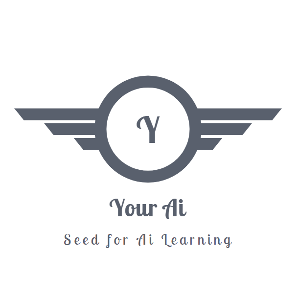

[![Build Status][build-shield]]()
[![Contributors][contributors-shield]]()
[![LinkedIn][linkedin-shield]][linkedin-url]

<!-- PROJECT LOGO -->
 

  <h2>YourAi (v1.1)</h2>
   
  

     
    <a><strong>Any One Can Detect. Easy to use with self-contained Computer Vision capabilities »</strong></a>
     
  

## Getting Started
**You can rename the folder and code in main.py to make "YOURAI"**

Download Yolo model for [Keras] which have .h5 extension and place in root directory. (more info in dependencies)

Run **main.py** file in root directory it will be up and running. Initially inbuilt camera is used but also support UDP stream like RTSP protocal. OPENCV wrapper is used for UDP streming.

If Error is Encountered **[ClickHere](https://github.com/dracoonhavoc/yourai/blob/master/Errors-with-Solution.md)**

### Dependencies

To use YourAi in your application developments, you must have installed the following dependencies before running program :
* **Python 3.5.1** (or later versions)
* **OpenCV**
* **Tensorflow 1.4** (or later versions)
* **Keras 2.x**
* YOLO Models are required **[Yolov3.h5](https://mega.nz/#!RmJgnArS!qGSVR2GvotvtJx5amQJt1f1JwT1wvogzd82xyUsmCDA)** or **[Tiny-Yolo.h5](https://mega.nz/#!d7YA0CRB!CypAkU93t7n0bjdTynGnkmahH_a6Yog1ADR6qWDCd0o)** click whichever you want.

## Built With Links

* [Python](https://www.python.org/)
* [Tensorflow](https://www.tensorflow.org/)
* [Keras](https://keras.io/)
* [OpenCV](https://opencv.org/)

## Authors

* **Kshitiz Neupane** - *Initial work* - [DracoonHavoc](https://github.com/dracoonhavoc)

## License

This project is licensed under the MIT License - see the [LICENSE.md](https://github.com/dracoonhavoc/yourai/blob/master/LICENSE) file for details

## In Future

* Will have ffmpeg server to receive video from anywhere if STATIC IP Required
* Support For More Models
<!-- MARKDOWN LINKS & IMAGES -->

[build-shield]: https://img.shields.io/badge/build-passing-brightgreen.svg?style=flat-square
[contributors-shield]: https://img.shields.io/badge/contributors-5-orange.svg?style=flat-square
[license-shield]: https://img.shields.io/badge/license-MIT-blue.svg?style=flat-square
[linkedin-shield]: https://img.shields.io/badge/-LinkedIn-black.svg?style=flat-square&logo=linkedin&colorB=555
[linkedin-url]: https://www.linkedin.com/in/kshitizneupane/
